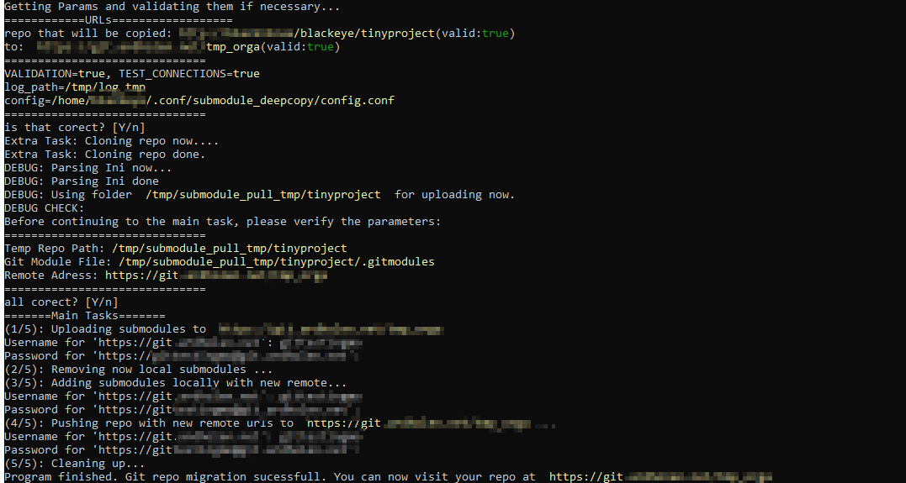

<!--
*** Thanks for checking out the Best-README-Template. If you have a suggestion
*** that would make this better, please fork the repo and create a pull request
*** or simply open an issue with the tag "enhancement".
*** Thanks again! Now go create something AMAZING! :D
***
***
***
*** To avoid retyping too much info. Do a search and replace for the following:
*** Blackeye, deepcopy_submodules, BlackeyeM, private_blackeye+github@posteo.de, Deep Copy of Submodules, project_description
-->

<!-- PROJECT SHIELDS -->
<!--
*** I'm using markdown "reference style" links for readability.
*** Reference links are enclosed in brackets [ ] instead of parentheses ( ).
*** See the bottom of this document for the declaration of the reference variables
*** for contributors-url, forks-url, etc. This is an optional, concise syntax you may use.
*** https://www.markdownguide.org/basic-syntax/#reference-style-links
-->
<!-- [![Contributors][contributors-shield]][contributors-url]
[![Forks][forks-shield]][forks-url]
[![Stargazers][stars-shield]][stars-url]
[![Issues][issues-shield]][issues-url]
[![MIT License][license-shield]][license-url] -->

<!-- PROJECT LOGO -->
<br />
<p align="center">
  <a href="https://github.com/Blackstareye/deepcopy_submodules">
    
  </a>

  <h3 align="center">Deep Copy of Submodules</h3>

  <p align="center">
    This bash program helps to migrate or deploy git projects with many submodules from a private area (like a LAN), to a public area (like github).
    <br />
    <a href="https://github.com/Blackstareye/deepcopy_submodules/issues">Report Bug</a>
    ·
    <a href="https://github.com/Blackstareye/deepcopy_submodules/issues">Request Feature</a>
  </p>
</p>

<!-- TABLE OF CONTENTS -->
<details open="open">
  <summary><h2 style="display: inline-block">Table of Contents</h2></summary>
  <ol>
    <li>
      <a href="#about-the-project">About The Project</a>
    </li>
    <li>
      <a href="#getting-started">Getting Started</a>
    </li>
    <li><a href="#usage">Usage</a></li>
    <li><a href="#roadmap">Roadmap</a></li>
    <li><a href="#contributing">Contributing</a></li>
    <li><a href="#license">License</a></li>
    <li><a href="#contact">Contact</a></li>
    <li><a href="#acknowledgements">Acknowledgements</a></li>
  </ol>
</details>

<!-- ABOUT THE PROJECT -->
## About The Project



  This bash program helps to migrate or deploy git projects with many submodules from a private area (like a LAN), to a public area (like github).

  I made it because I had exactly that situation: having a local git server AND a public one. When I wanted to migrate some Projects (and they had many submodules) the issue was always doing the exactly steps over and over again:

1. cloning the project from the private repo
2. changing the .gitmodules file and changing each url to the "new remote"
3. changing the .git/conf file and changing each url to the "new remote"
4. deleting the modules from .git/modules and /modules
5. adding remote and push each submodule
6. adding remote and push "root" git repo

Also it was a mess doing that steps over and over and then realising it's a faulty url...

So I made this project.

### Funfact - Trivia

I also tried some test concepts I learned in university for testcoverage. It was also an ..let's say experience writing unit test in and for bash oO.

Have a look on [Test Coverage](https://github.com/Blackstareye/deep_copy_submodules_test/blob/cc6e981a8a8f977e83afe5fcea58bae45756e76f/testcoverage.md)
  
## Getting Started

To get a local copy up and running follow these simple steps.

1. clone the repo
2. have a look on the config.conf (see [config](config.conf))
3. cd to the cloned repo and run `install.sh`:
   1. > `cd <cloned_repo>`
   2. >`bash install.sh`
4. run the program
   1. > `bash deep_copy_submodules.sh "remote" "<private_url>" "<public_url>"`

<!-- USAGE EXAMPLES -->
## Usage

```bash
# try deep deep_copy_submodules.sh --usuage for usuage information
deep deep_copy_submodules.sh --usuage

# remote private repo
bash deep_copy_submodules.sh "remote" "https://privatefoo.bar" "https://public_foo.bar"
# ssh private repo
bash deep_copy_submodules.sh "ssh" "git@git-server" "https://public_foo.bar"
# local private repo
bash deep_copy_submodules.sh "local" "/foo/bar/git_repo" "<public_url>"

```

### Parameter

* --help  Shows the help for that script
* --usuage Shows the usuage for that script
* -v Enables Validation if it is in config not set
* -t Enables Testing_Connections if it is in config not set

**Validation:** The Connection can be checked before they will be progressed with this flag. This will enable syntax checking of the given urls and parameters. If also **Testing Connections** is enabled, the connections will also be checked with curl.

**Testing Connections:** Connections can be checked before they will be progressed with this flag. A curl request will be used for checking

**WARNING:** If validation is turned off, the urls will be used as they are with no further checking. use this with caution or if you know what you do.


### Config

The Config explanation is added directly to the given config parameter.
see: [config](config.conf)

### IMPORTANT NOTES

* SSH can only be used for the first repo not for the uploading target repo
* Git-Submodules can only be parsed if they don't contain a '-' "dash" in the folder and or module name
  * this relies on the fact, that I parse the sections of the .gitmodules ini into dynamic variables like
    * `$configuration_submodule[key]=value`

### Known Issues

Unfortunately projects with git lfs do not work on the sytems I use it. So I can't guarantee if it will work. But this is the first issue I will hunt down and fix.

<!-- ROADMAP -->
## Roadmap

See the [open issues](https://github.com/Blackstareye/deepcopy_submodules/issues) for a list of proposed features (and known issues).

<!-- CONTRIBUTING -->
## Contributing

If you have an idea for amazing feature or a nice way to do things more easily in bash you can submit it like the following:

1. Fork the Project
2. Create your Feature Branch (`git checkout -b feature/AmazingFeature`)
3. Commit your Changes (`git commit -m 'Add some AmazingFeature'`)
4. Push to the Branch (`git push origin feature/AmazingFeature`)
5. Open a Pull Request

## Testing

  Have a look on 
  
  * [README.md](https://github.com/Blackstareye/deep_copy_submodules_test) 
  * [Test Coverage](https://github.com/Blackstareye/deep_copy_submodules_test/blob/cc6e981a8a8f977e83afe5fcea58bae45756e76f/testcoverage.md)
<!-- LICENSE -->
## License

Distributed under the GPL version 3. See `LICENSE` for more information.

Images are licensed under the License [Attribution-NonCommercial-NoDerivatives 4.0 International (CC BY-NC-ND 4.0)](https://creativecommons.org/licenses/by-nc-nd/4.0/)

<!-- CONTACT -->
## Contact

Blackeye - [@BlackeyeM](https://twitter.com/BlackeyeM) - private_blackeye+deepcopy@posteo.de

Project Link: [https://github.com/Blackstareye/deepcopy_submodules](https://github.com/Blackstareye/deepcopy_submodules)

<!-- ACKNOWLEDGEMENTS -->
## Acknowledgements

* Talks, raw testing, helpful tips and Opinions: [Columbarius](https://github.com/columbarius)
* [Readme Template](https://github.com/othneildrew/Best-README-Template)

For Testing, thanks for those amazing projects, that make bash unit testing AT LEAST doable.

* [BATS-Core as Unit Testing Framework](https://github.com/bats-core/bats-core)
* [BATS-Support for Plugins in BATS](https://github.com/bats-core/bats-support)
* Plugins:
  * [BATS Assert](https://github.com/bats-core/bats-assert)
  * [BATS File](https://github.com/bats-core/bats-file)

<!-- MARKDOWN LINKS & IMAGES -->
<!-- https://www.markdownguide.org/basic-syntax/#reference-style-links -->
[contributors-shield]: https://img.shields.io/github/contributors/Blackeye/repo.svg?style=for-the-badge
[contributors-url]: https://github.com/Blackeye/repo/graphs/contributors
[forks-shield]: https://img.shields.io/github/forks/Blackeye/repo.svg?style=for-the-badge
[forks-url]: https://github.com/Blackeye/repo/network/members
[stars-shield]: https://img.shields.io/github/stars/Blackeye/repo.svg?style=for-the-badge
[stars-url]: https://github.com/Blackeye/repo/stargazers
[issues-shield]: https://img.shields.io/github/issues/Blackeye/repo.svg?style=for-the-badge
[issues-url]: https://github.com/Blackeye/repo/issues
[license-shield]: https://img.shields.io/github/license/Blackeye/repo.svg?style=for-the-badge
[license-url]: https://github.com/Blackeye/repo/blob/master/LICENSE.txt
[linkedin-shield]: https://img.shields.io/badge/-LinkedIn-black.svg?style=for-the-badge&logo=linkedin&colorB=555
[linkedin-url]: https://linkedin.com/in/Blackeye

## Additional Info

### used Language

bash

### used Software

bats, shellchecker

### Status

published
